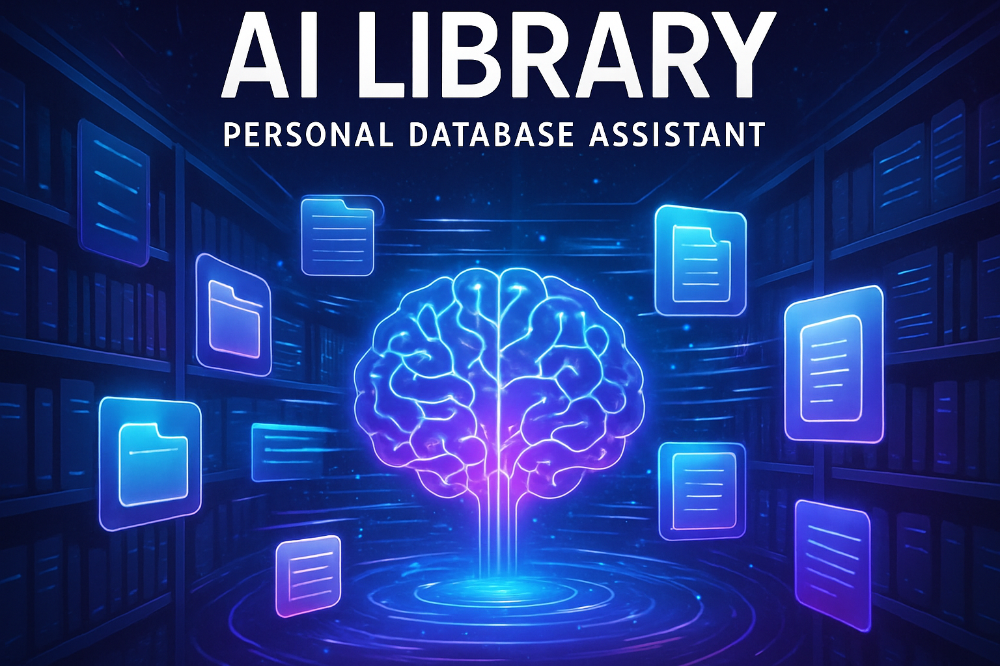

# AI Library - Personal Database Assistant



**Transform any personal file collection into an intelligent, searchable library using AI.**

## 🌟 Overview

AI Library is a desktop application that eliminates the frustration of manually searching through large datasets by providing an AI assistant that knows your entire file collection. Simply point the app to your files, let it build a catalog automatically, and then ask questions in plain English to find exactly what you need.

### Key Features

- **🧠 AI-Powered Search**: Ask natural language questions like "Do I have that chocolate cake recipe?" or "Show me my vacation photos from 2023"
- **🔄 Automated Cataloging**: Set it and forget it - the app scans and catalogs everything automatically (20-30 minutes for most collections)
- **📁 Universal File Support**: Handles ALL file types - documents, images, videos, audio, spreadsheets, code files, and more
- **🎯 Instant Results**: Get immediate, accurate answers with clickable file links
- **🔒 Privacy First**: Everything runs locally on your machine - your files never leave your computer
- **👵 Grandma-Friendly**: Designed for extreme ease of use - if you can't figure it out in 30 seconds, it's too complicated

## 🚀 Quick Start

### Prerequisites

Choose one of these AI options:

**Option 1: Local AI Model (Recommended)**
- Install [Ollama](https://ollama.ai/) and run a model like `llama2`
- The app will connect to `http://localhost:11434` by default

**Option 2: Cloud AI Service**
- Get an API key from [OpenAI](https://openai.com/api/), [Anthropic](https://www.anthropic.com/), or similar
- Have your API key ready during setup

### Installation

1. **Clone the repository**:
   ```bash
   git clone https://github.com/Baswold/AI-liberry.git
   cd AI-liberry
   ```

2. **Set up the backend**:
   ```bash
   cd backend
   python3 -m venv venv
   source venv/bin/activate  # On Windows: venv\Scripts\activate
   pip install -r requirements.txt
   ```

3. **Set up the frontend**:
   ```bash
   cd ../frontend
   npm install
   ```

4. **Build the application**:
   ```bash
   npm run build
   ```

5. **Run the application**:
   ```bash
   npm run electron
   ```

### Creating Installers (Optional)

To create installers for your specific operating system, run the following commands from the `frontend` directory:

```bash
# Build for current platform (e.g., Linux AppImage)
npm run dist

# Build for macOS DMG
npm run dist-mac

# Build for Windows NSIS installer
npm run dist-win

# Build for all platforms
npm run dist-all
```

**Note:** Building installers requires additional dependencies and may not work in all environments. If you encounter issues, please refer to the [electron-builder documentation](https://www.electron.build/).

### First-Time Setup

1. **Choose Your AI**: Select between local model or cloud API
2. **Configure AI**: Enter your local endpoint or API key
3. **Select Files**: Point the app to your file directory
4. **Start Building**: Click "Start Building My Library"
5. **Walk Away**: The app will spend 20-30 minutes cataloging everything automatically
6. **Start Searching**: When complete, ask questions in plain English!

## 💡 Usage Examples

Once your catalog is built, you can ask questions like:

- "Do I have a file about chocolate cake?"
- "Where did I save my resume?"
- "Show me everything related to my 2023 vacation"
- "Find my Python projects"
- "Do I have any spreadsheets with budget data?"
- "Show me photos from last Christmas"

The AI will understand your intent and provide relevant files with one-click access.

## 🏗️ Architecture

### Frontend
- **Electron + React**: Cross-platform desktop application
- **Modern UI**: Clean, intuitive interface with real-time progress tracking
- **Responsive Design**: Works on all screen sizes

### Backend
- **Python + Flask**: Lightweight local server for file processing
- **SQLite Database**: Efficient local storage with full-text search
- **AI Integration**: Supports both local models (Ollama) and cloud APIs

### File Processing
- **Universal Support**: Handles 50+ file types
- **Content Extraction**: Reads text from PDFs, Word docs, spreadsheets
- **Metadata Extraction**: Captures EXIF data, audio tags, file properties
- **Smart Descriptions**: AI generates searchable descriptions for all files

## 🔧 Development

### Project Structure
```
ai_library/
├── frontend/           # Electron + React application
│   ├── src/           # React components and logic
│   ├── assets/        # Icons and images
│   └── dist/          # Built frontend files
├── backend/           # Python Flask server
│   ├── app.py         # Main Flask application
│   ├── catalog_builder.py  # File scanning and indexing
│   ├── search_engine.py    # Search logic
│   ├── ai_client.py   # AI provider integration
│   └── venv/          # Python virtual environment
└── README.md
```

### Building from Source

1. **Clone the repository**:
   ```bash
   git clone https://github.com/Baswold/AI-liberry.git
   cd AI-liberry
   ```

2. **Set up the backend**:
   ```bash
   cd backend
   python3 -m venv venv
   source venv/bin/activate  # On Windows: venv\Scripts\activate
   pip install -r requirements.txt
   ```

3. **Set up the frontend**:
   ```bash
   cd ../frontend
   npm install
   ```

4. **Build and run**:
   ```bash
   npm run build
   npm run electron
   ```

### Creating Installers

```bash
# Build for current platform
npm run dist

# Build for specific platforms
npm run dist-mac    # macOS DMG
npm run dist-win    # Windows NSIS installer
npm run dist-all    # All platforms
```

## 🤝 Contributing

We welcome contributions! Please see our [Contributing Guidelines](CONTRIBUTING.md) for details.

### Areas for Contribution
- Additional file type support
- Performance optimizations
- UI/UX improvements
- Documentation
- Testing
- Internationalization

## 📄 License

This project is licensed under the MIT License - see the [LICENSE](LICENSE) file for details.

## 🙏 Acknowledgments

- Built with [Electron](https://www.electronjs.org/) and [React](https://reactjs.org/)
- AI integration supports [Ollama](https://ollama.ai/), [OpenAI](https://openai.com/), and other providers
- File processing powered by Python libraries: PyPDF2, python-docx, Pillow, and more

## 📞 Support

- **Issues**: [GitHub Issues](https://github.com/Baswold/AI-liberry/issues)
- **Discussions**: [GitHub Discussions](https://github.com/Baswold/AI-liberry/discussions)

---

**Made with ❤️ for everyone tired of manually searching through their files.**


